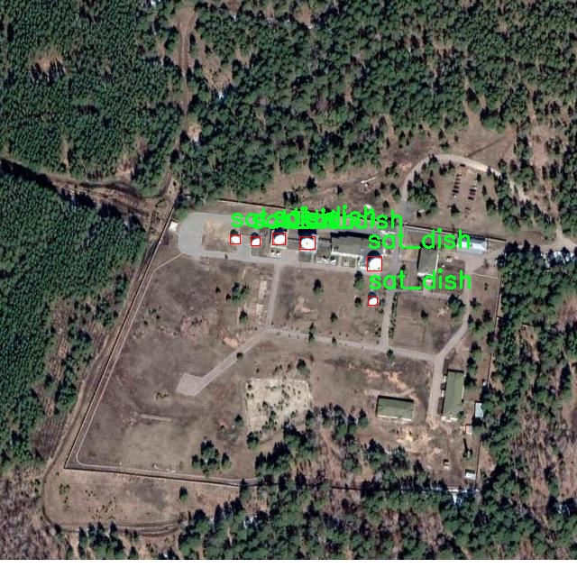

# 改进yolo11-AKConv等200+全套创新点大全：卫星图雷达天线检测系统源码＆数据集全套

### 1.图片效果展示


##### 注意：由于项目一直在更新迭代，上面“1.图片效果展示”和“2.视频效果展示”展示的系统图片或者视频可能为老版本，新版本在老版本的基础上升级如下：（实际效果以升级的新版本为准）

  （1）适配了YOLOV11的“目标检测”模型和“实例分割”模型，通过加载相应的权重（.pt）文件即可自适应加载模型。

  （2）支持“图片识别”、“视频识别”、“摄像头实时识别”三种识别模式。

  （3）支持“图片识别”、“视频识别”、“摄像头实时识别”三种识别结果保存导出，解决手动导出（容易卡顿出现爆内存）存在的问题，识别完自动保存结果并导出到tempDir中。

  （4）支持Web前端系统中的标题、背景图等自定义修改。

  另外本项目提供训练的数据集和训练教程,暂不提供权重文件（best.pt）,需要您按照教程进行训练后实现图片演示和Web前端界面演示的效果。

### 2.视频效果展示

[2.1 视频效果展示](https://www.bilibili.com/video/BV1d9yiYmEJw/)

### 3.背景

##### 项目来源 [人工智能促进会 2024.10.20](https://kdocs.cn/l/cszuIiCKVNis)

研究背景与意义

随着遥感技术的迅猛发展，卫星图像在城市规划、环境监测、农业管理等领域的应用日益广泛。尤其是在城市基础设施的监测与管理中，卫星图像的高分辨率特性使其成为了不可或缺的工具。然而，传统的图像处理方法在复杂环境下的目标检测效果往往不尽如人意，尤其是在存在多种干扰因素的情况下，如何准确识别和定位卫星图雷达天线成为了一个亟待解决的难题。

YOLO（You Only Look Once）系列模型以其高效的实时目标检测能力受到广泛关注。YOLOv11作为该系列的最新版本，具备了更强的特征提取能力和更快的处理速度，能够在复杂背景中实现高精度的目标检测。然而，针对特定应用场景的改进仍然是提升模型性能的关键。基于此，本研究旨在对YOLOv11进行改进，以适应卫星图像中雷达天线的检测需求。

本项目将使用包含215幅图像的sat_dish数据集进行训练和测试。该数据集专注于卫星图雷达天线的检测，涵盖了多种不同的场景和背景，具有较高的代表性。通过对YOLOv11模型的优化，期望能够提升其在卫星图像中对雷达天线的检测精度和召回率，从而为相关领域的研究和应用提供更加可靠的技术支持。

综上所述，本研究不仅具有重要的理论意义，还将为实际应用提供有效的解决方案，推动卫星图像处理技术的发展，为城市管理、环境监测等领域的智能化进程贡献力量。

### 4.数据集信息展示

##### 4.1 本项目数据集详细数据（类别数＆类别名）

nc: 1
names: ['sat_dish']


该项目为【目标检测】数据集，请在【训练教程和Web端加载模型教程（第三步）】这一步的时候按照【目标检测】部分的教程来训练

##### 4.2 本项目数据集信息介绍

本项目数据集信息介绍

本项目所使用的数据集名为“0”，专门用于训练和改进YOLOv11模型，以实现高效的卫星图雷达天线检测系统。该数据集包含了一个类别，具体为“sat_dish”，即卫星天线。为了确保模型的准确性和鲁棒性，数据集中的样本经过精心挑选和标注，涵盖了不同环境和条件下的卫星天线图像。这些图像不仅包括城市和乡村的卫星天线，还涉及不同角度、光照条件及背景的变化，力求在多样性上满足实际应用需求。

数据集的构建过程中，考虑到了卫星天线在实际应用中的多样性与复杂性。为了提升模型的检测能力，数据集中的图像均经过专业标注，确保每个样本的卫星天线都被准确框定。这种高质量的标注不仅为YOLOv11模型的训练提供了可靠的基础，也为后续的模型评估和优化奠定了良好的数据基础。

在数据集的准备过程中，我们还特别关注了数据的平衡性和代表性，确保“sat_dish”这一类别在不同场景下的样本数量足够，以避免模型在训练过程中出现偏差。此外，数据集的多样性还体现在不同分辨率和尺寸的图像上，这将帮助模型在面对实际应用中的各种情况时，具备更强的适应能力。

通过使用这一数据集，我们期望能够显著提升YOLOv11在卫星图雷达天线检测任务中的性能，进而推动相关领域的研究与应用。




### 5.全套项目环境部署视频教程（零基础手把手教学）

[5.1 所需软件PyCharm和Anaconda安装教程（第一步）](https://www.bilibili.com/video/BV1BoC1YCEKi/?spm_id_from=333.999.0.0&vd_source=bc9aec86d164b67a7004b996143742dc)


[5.2 安装Python虚拟环境创建和依赖库安装视频教程（第二步）](https://www.bilibili.com/video/BV1ZoC1YCEBw?spm_id_from=333.788.videopod.sections&vd_source=bc9aec86d164b67a7004b996143742dc)

### 6.改进YOLOv11训练教程和Web_UI前端加载模型教程（零基础手把手教学）

[6.1 改进YOLOv11训练教程和Web_UI前端加载模型教程（第三步）](https://www.bilibili.com/video/BV1BoC1YCEhR?spm_id_from=333.788.videopod.sections&vd_source=bc9aec86d164b67a7004b996143742dc)


按照上面的训练视频教程链接加载项目提供的数据集，运行train.py即可开始训练



     Epoch   gpu_mem       box       obj       cls    labels  img_size
     1/200     20.8G   0.01576   0.01955  0.007536        22      1280: 100%|██████████| 849/849 [14:42<00:00,  1.04s/it]
               Class     Images     Labels          P          R     mAP@.5 mAP@.5:.95: 100%|██████████| 213/213 [01:14<00:00,  2.87it/s]
                 all       3395      17314      0.994      0.957      0.0957      0.0843

     Epoch   gpu_mem       box       obj       cls    labels  img_size
     2/200     20.8G   0.01578   0.01923  0.007006        22      1280: 100%|██████████| 849/849 [14:44<00:00,  1.04s/it]
               Class     Images     Labels          P          R     mAP@.5 mAP@.5:.95: 100%|██████████| 213/213 [01:12<00:00,  2.95it/s]
                 all       3395      17314      0.996      0.956      0.0957      0.0845

     Epoch   gpu_mem       box       obj       cls    labels  img_size
     3/200     20.8G   0.01561    0.0191  0.006895        27      1280: 100%|██████████| 849/849 [10:56<00:00,  1.29it/s]
               Class     Images     Labels          P          R     mAP@.5 mAP@.5:.95: 100%|███████   | 187/213 [00:52<00:00,  4.04it/s]
                 all       3395      17314      0.996      0.957      0.0957      0.0845


###### [项目数据集下载链接](https://kdocs.cn/l/cszuIiCKVNis)

### 7.原始YOLOv11算法讲解

##### YOLO11简介

> YOLO11源码地址：https://github.com/ultralytics/ultralytics

Ultralytics
YOLO11是一款尖端的、最先进的模型，它在之前YOLO版本成功的基础上进行了构建，并引入了新功能和改进，以进一步提升性能和灵活性。YOLO11设计快速、准确且易于使用，使其成为各种物体检测和跟踪、实例分割、图像分类以及姿态估计任务的绝佳选择。  


**YOLO11创新点如下:**

YOLO 11主要改进包括：  
`增强的特征提取`：YOLO 11采用了改进的骨干和颈部架构，增强了特征提取功能，以实现更精确的目标检测。  
`优化的效率和速度`：优化的架构设计和优化的训练管道提供更快的处理速度，同时保持准确性和性能之间的平衡。  
`更高的精度，更少的参数`：YOLO11m在COCO数据集上实现了更高的平均精度（mAP），参数比YOLOv8m少22%，使其在不影响精度的情况下提高了计算效率。  
`跨环境的适应性`：YOLO 11可以部署在各种环境中，包括边缘设备、云平台和支持NVIDIA GPU的系统。  
`广泛的支持任务`：YOLO 11支持各种计算机视觉任务，如对象检测、实例分割、图像分类、姿态估计和面向对象检测（OBB）。

**YOLO11不同模型尺寸信息：**

YOLO11 提供5种不同的型号规模模型，以满足不同的应用需求：

Model| size (pixels)| mAPval 50-95| Speed CPU ONNX (ms)| Speed T4 TensorRT10
(ms)| params (M)| FLOPs (B)  
---|---|---|---|---|---|---  
YOLO11n| 640| 39.5| 56.1 ± 0.8| 1.5 ± 0.0| 2.6| 6.5  
YOLO11s| 640| 47.0| 90.0 ± 1.2| 2.5 ± 0.0| 9.4| 21.5  
YOLO11m| 640| 51.5| 183.2 ± 2.0| 4.7 ± 0.1| 20.1| 68.0  
YOLO11l| 640| 53.4| 238.6 ± 1.4| 6.2 ± 0.1| 25.3| 86.9  
YOLO11x| 640| 54.7| 462.8 ± 6.7| 11.3 ± 0.2| 56.9| 194.9  
  
**模型常用训练超参数参数说明：**  
`YOLOv11
模型的训练设置包括训练过程中使用的各种超参数和配置`。这些设置会影响模型的性能、速度和准确性。关键的训练设置包括批量大小、学习率、动量和权重衰减。此外，优化器、损失函数和训练数据集组成的选择也会影响训练过程。对这些设置进行仔细的调整和实验对于优化性能至关重要。  
**以下是一些常用的模型训练参数和说明：**

参数名| 默认值| 说明  
---|---|---  
`model`| `None`| 指定用于训练的模型文件。接受指向 `.pt` 预训练模型或 `.yaml`
配置文件。对于定义模型结构或初始化权重至关重要。  
`data`| `None`| 数据集配置文件的路径（例如
`coco8.yaml`).该文件包含特定于数据集的参数，包括训练数据和验证数据的路径、类名和类数。  
`epochs`| `100`| 训练总轮数。每个epoch代表对整个数据集进行一次完整的训练。调整该值会影响训练时间和模型性能。  
`patience`| `100`| 在验证指标没有改善的情况下，提前停止训练所需的epoch数。当性能趋于平稳时停止训练，有助于防止过度拟合。  
`batch`| `16`| 批量大小，有三种模式:设置为整数(例如，’ Batch =16 ‘)， 60% GPU内存利用率的自动模式(’ Batch
=-1 ‘)，或指定利用率分数的自动模式(’ Batch =0.70 ')。  
`imgsz`| `640`| 用于训练的目标图像尺寸。所有图像在输入模型前都会被调整到这一尺寸。影响模型精度和计算复杂度。  
`device`| `None`| 指定用于训练的计算设备：单个 GPU (`device=0`）、多个 GPU (`device=0,1`)、CPU
(`device=cpu`)，或苹果芯片的 MPS (`device=mps`).  
`workers`| `8`| 加载数据的工作线程数（每 `RANK` 多 GPU 训练）。影响数据预处理和输入模型的速度，尤其适用于多 GPU 设置。  
`name`| `None`| 训练运行的名称。用于在项目文件夹内创建一个子目录，用于存储训练日志和输出结果。  
`pretrained`| `True`| 决定是否从预处理模型开始训练。可以是布尔值，也可以是加载权重的特定模型的字符串路径。提高训练效率和模型性能。  
`optimizer`| `'auto'`| 为训练模型选择优化器。选项包括 `SGD`, `Adam`, `AdamW`, `NAdam`,
`RAdam`, `RMSProp` 等，或 `auto` 用于根据模型配置进行自动选择。影响收敛速度和稳定性  
`lr0`| `0.01`| 初始学习率（即 `SGD=1E-2`, `Adam=1E-3`) .调整这个值对优化过程至关重要，会影响模型权重的更新速度。  
`lrf`| `0.01`| 最终学习率占初始学习率的百分比 = (`lr0 * lrf`)，与调度程序结合使用，随着时间的推移调整学习率。  
  
### 3\. 训练结果评估

在深度学习中，我们通常用损失函数下降的曲线来观察模型训练的情况。YOLO11在训练时主要包含三个方面的损失：定位损失(box_loss)、分类损失(cls_loss)和动态特征损失（dfl_loss），
**在训练结束后，可以在`runs/`目录下找到训练过程及结果文件**，如下所示：  


**各损失函数作用说明：**  
`定位损失box_loss`：预测框与标定框之间的误差（GIoU），越小定位得越准；  
`分类损失cls_loss`：计算锚框与对应的标定分类是否正确，越小分类得越准；  
`动态特征损失（dfl_loss）`：DFLLoss是一种用于回归预测框与目标框之间距离的损失函数。在计算损失时，目标框需要缩放到特征图尺度，即除以相应的stride，并与预测的边界框计算Ciou
Loss，同时与预测的anchors中心点到各边的距离计算回归DFLLoss。  


### 8.200+种全套改进YOLOV11创新点原理讲解

#### 8.1 200+种全套改进YOLOV11创新点原理讲解大全

###### 由于篇幅限制，每个创新点的具体原理讲解就不全部展开，具体见下列网址中的创新点对应项目的技术原理博客网址【Blog】（创新点均为模块化搭建，原理适配YOLOv5~YOLOv11等各种版本）

[8.1 技术原理博客【Blog】网址链接](https://gitee.com/qunmasj/good)


#### 8.2 精选部分改进YOLOV11创新点原理讲解

###### 这里节选部分改进创新点展开原理讲解(完整的改进原理见上图和[技术博客链接](https://gitee.com/qunmasj/good))【如果此小节的图加载失败可以通过CSDN或者Github搜索该博客的标题访问原始博客，原始博客图片显示正常】

### Gold-YOLO


#### Preliminaries
YOLO系列的中间层结构采用了传统的FPN结构，其中包含多个分支用于多尺度特征融合。然而，它只充分融合来自相邻级别的特征，对于其他层次的信息只能间接地进行“递归”获取。

传统的FPN结构在信息传输过程中存在丢失大量信息的问题。这是因为层之间的信息交互仅限于中间层选择的信息，未被选择的信息在传输过程中被丢弃。这种情况导致某个Level的信息只能充分辅助相邻层，而对其他全局层的帮助较弱。因此，整体上信息融合的有效性可能受到限制。
为了避免在传输过程中丢失信息，本文采用了一种新颖的“聚集和分发”机制（GD），放弃了原始的递归方法。该机制使用一个统一的模块来收集和融合所有Level的信息，并将其分发到不同的Level。通过这种方式，作者不仅避免了传统FPN结构固有的信息丢失问题，还增强了中间层的部分信息融合能力，而且并没有显著增加延迟。


#### 低阶聚合和分发分支 Low-stage gather-and-distribute branch
从主干网络中选择输出的B2、B3、B4、B5特征进行融合，以获取保留小目标信息的高分辨率特征。


#### 高阶聚合和分发分支 High-stage gather-and-distribute branch
高级全局特征对齐模块（High-GD）将由低级全局特征对齐模块（Low-GD）生成的特征{P3, P4, P5}进行融合。


Transformer融合模块由多个堆叠的transformer组成，transformer块的数量为L。每个transformer块包括一个多头注意力块、一个前馈网络（FFN）和残差连接。采用与LeViT相同的设置来配置多头注意力块，使用16个通道作为键K和查询Q的头维度，32个通道作为值V的头维度。为了加速推理过程，将层归一化操作替换为批归一化，并将所有的GELU激活函数替换为ReLU。为了增强变换器块的局部连接，在两个1x1卷积层之间添加了一个深度卷积层。同时，将FFN的扩展因子设置为2，以在速度和计算成本之间取得平衡。


信息注入模块(Information injection module)： 高级全局特征对齐模块（High-GD）中的信息注入模块与低级全局特征对齐模块（Low-GD）中的相同。在高级阶段，局部特征（Flocal）等于Pi，因此公式如下所示：


#### 增强的跨层信息流动 Enhanced cross-layer information flow
为了进一步提升性能，从YOLOv6 中的PAFPN模块中得到启发，引入了Inject-LAF模块。该模块是注入模块的增强版，包括了一个轻量级相邻层融合（LAF）模块，该模块被添加到注入模块的输入位置。为了在速度和准确性之间取得平衡，设计了两个LAF模型：LAF低级模型和LAF高级模型，分别用于低级注入（合并相邻两层的特征）和高级注入（合并相邻一层的特征）。它们的结构如图5(b)所示。为了确保来自不同层级的特征图与目标大小对齐，在实现中的两个LAF模型仅使用了三个操作符：双线性插值（上采样过小的特征）、平均池化（下采样过大的特征）和1x1卷积（调整与目标通道不同的特征）。模型中的LAF模块与信息注入模块的结合有效地平衡了准确性和速度之间的关系。通过使用简化的操作，能够增加不同层级之间的信息流路径数量，从而提高性能而不显著增加延迟。


### 9.系统功能展示

图9.1.系统支持检测结果表格显示

  图9.2.系统支持置信度和IOU阈值手动调节

  图9.3.系统支持自定义加载权重文件best.pt(需要你通过步骤5中训练获得)

  图9.4.系统支持摄像头实时识别

  图9.5.系统支持图片识别

  图9.6.系统支持视频识别

  图9.7.系统支持识别结果文件自动保存

  图9.8.系统支持Excel导出检测结果数据


### 10. YOLOv11核心改进源码讲解

#### 10.1 rep_block.py

以下是经过简化和注释的核心代码部分，主要集中在 `DiverseBranchBlock` 和相关的辅助函数上。这个代码主要实现了一个具有多分支结构的卷积块，通常用于深度学习中的卷积神经网络（CNN）。

```python
import torch
import torch.nn as nn
import torch.nn.functional as F

def transI_fusebn(kernel, bn):
    """
    将卷积核和批归一化层的参数融合，返回融合后的卷积核和偏置。
    :param kernel: 卷积核
    :param bn: 批归一化层
    :return: 融合后的卷积核和偏置
    """
    gamma = bn.weight  # 批归一化的缩放因子
    std = (bn.running_var + bn.eps).sqrt()  # 标准差
    return kernel * ((gamma / std).reshape(-1, 1, 1, 1)), bn.bias - bn.running_mean * gamma / std

class BNAndPadLayer(nn.Module):
    """
    结合批归一化和填充的层
    """
    def __init__(self, pad_pixels, num_features, eps=1e-5, momentum=0.1, affine=True, track_running_stats=True):
        super(BNAndPadLayer, self).__init__()
        self.bn = nn.BatchNorm2d(num_features, eps, momentum, affine, track_running_stats)
        self.pad_pixels = pad_pixels  # 填充的像素数

    def forward(self, input):
        output = self.bn(input)  # 先进行批归一化
        if self.pad_pixels > 0:
            pad_values = self.bn.bias.detach() - self.bn.running_mean * self.bn.weight.detach() / torch.sqrt(self.bn.running_var + self.bn.eps)
            output = F.pad(output, [self.pad_pixels] * 4)  # 填充
            pad_values = pad_values.view(1, -1, 1, 1)
            output[:, :, 0:self.pad_pixels, :] = pad_values  # 上填充
            output[:, :, -self.pad_pixels:, :] = pad_values  # 下填充
            output[:, :, :, 0:self.pad_pixels] = pad_values  # 左填充
            output[:, :, :, -self.pad_pixels:] = pad_values  # 右填充
        return output

class DiverseBranchBlock(nn.Module):
    """
    多分支卷积块
    """
    def __init__(self, in_channels, out_channels, kernel_size, stride=1, padding=None, dilation=1, groups=1):
        super(DiverseBranchBlock, self).__init__()
        
        if padding is None:
            padding = kernel_size // 2  # 默认填充为卷积核大小的一半

        # 定义主卷积层
        self.dbb_origin = nn.Sequential(
            nn.Conv2d(in_channels, out_channels, kernel_size, stride=stride, padding=padding, groups=groups, bias=False),
            nn.BatchNorm2d(out_channels)
        )

        # 定义平均池化分支
        self.dbb_avg = nn.Sequential(
            nn.Conv2d(in_channels, out_channels, kernel_size=1, stride=1, padding=0, groups=groups, bias=False),
            BNAndPadLayer(pad_pixels=padding, num_features=out_channels),
            nn.AvgPool2d(kernel_size=kernel_size, stride=stride, padding=0),
            nn.BatchNorm2d(out_channels)
        )

    def forward(self, inputs):
        # 计算各个分支的输出
        out = self.dbb_origin(inputs)  # 主卷积输出
        out += self.dbb_avg(inputs)  # 平均池化分支输出
        return out  # 返回合并后的输出

# 示例使用
# block = DiverseBranchBlock(in_channels=64, out_channels=128, kernel_size=3)
# output = block(torch.randn(1, 64, 32, 32))  # 输入一个随机张量
```

### 代码说明：
1. **transI_fusebn**: 该函数用于将卷积层的权重与批归一化层的参数融合，返回融合后的卷积核和偏置。
2. **BNAndPadLayer**: 这个类结合了批归一化和填充的功能，适用于卷积操作后需要进行归一化和填充的场景。
3. **DiverseBranchBlock**: 这是一个多分支卷积块，包含主卷积分支和平均池化分支。它通过多个分支来增强特征提取能力。
4. **forward**: 在前向传播中，计算各个分支的输出并将其相加，形成最终的输出。

这个简化的版本保留了核心功能和结构，同时添加了详细的中文注释，便于理解每个部分的作用。

这个文件 `rep_block.py` 是一个实现多分支卷积块的 PyTorch 模块，主要用于深度学习中的卷积神经网络（CNN）。文件中定义了多个类和函数，目的是为了构建不同类型的卷积块，包括 `DiverseBranchBlock`、`WideDiverseBranchBlock` 和 `DeepDiverseBranchBlock`，这些类都继承自 `nn.Module`。

首先，文件导入了必要的库，包括 PyTorch 的核心库和一些自定义的卷积模块。接着，定义了一些用于卷积和批归一化的转换函数，例如 `transI_fusebn`、`transII_addbranch` 等，这些函数主要用于处理卷积核和偏置的融合、分支的组合等操作。

`conv_bn` 函数用于创建一个包含卷积层和批归一化层的序列模块。接下来的 `IdentityBasedConv1x1` 类实现了一个带有身份映射的 1x1 卷积层，确保在卷积操作中保留输入的特征。

`BNAndPadLayer` 类则实现了一个结合了批归一化和填充的层，能够在进行批归一化后对输出进行填充，以保持特征图的尺寸。

`DiverseBranchBlock` 类是实现多分支卷积块的核心部分。它的构造函数接受多个参数，包括输入通道数、输出通道数、卷积核大小等。根据不同的条件，它会创建多个分支，包括原始卷积分支、1x1 卷积分支、平均池化分支等。每个分支都可以通过批归一化层进行处理。

`get_equivalent_kernel_bias` 方法用于获取等效的卷积核和偏置，通过调用前面定义的转换函数来融合不同分支的卷积核和偏置。`switch_to_deploy` 方法则用于在推理阶段切换到一个参数化的卷积层，以提高计算效率。

`DiverseBranchBlockNOAct` 类是一个不带非线性激活函数的多分支卷积块实现，适用于某些特定的场景。`DeepDiverseBranchBlock` 和 `WideDiverseBranchBlock` 类则是对 `DiverseBranchBlock` 的扩展，增加了更多的功能和灵活性，例如处理不同的卷积核形状和填充方式。

总的来说，这个文件实现了一个灵活且高效的多分支卷积块，适用于各种深度学习任务，特别是在图像处理和计算机视觉领域。通过不同的分支结构和卷积操作，可以提取更丰富的特征，从而提高模型的性能。

#### 10.2 kaln_conv.py

以下是代码中最核心的部分，并附上详细的中文注释：

```python
from functools import lru_cache
import torch
import torch.nn as nn
from torch.nn.functional import conv3d, conv2d, conv1d

class KALNConvNDLayer(nn.Module):
    def __init__(self, conv_class, norm_class, conv_w_fun, input_dim, output_dim, degree, kernel_size,
                 groups=1, padding=0, stride=1, dilation=1, dropout: float = 0.0, ndim: int = 2):
        super(KALNConvNDLayer, self).__init__()
        
        # 初始化参数
        self.inputdim = input_dim  # 输入维度
        self.outdim = output_dim    # 输出维度
        self.degree = degree         # 多项式的阶数
        self.kernel_size = kernel_size  # 卷积核大小
        self.padding = padding       # 填充
        self.stride = stride         # 步幅
        self.dilation = dilation     # 膨胀
        self.groups = groups         # 分组卷积的组数
        self.base_activation = nn.SiLU()  # 基础激活函数
        self.conv_w_fun = conv_w_fun  # 卷积权重函数
        self.ndim = ndim             # 数据的维度（1D, 2D, 3D）
        self.dropout = None          # Dropout层

        # 根据维度初始化Dropout层
        if dropout > 0:
            if ndim == 1:
                self.dropout = nn.Dropout1d(p=dropout)
            elif ndim == 2:
                self.dropout = nn.Dropout2d(p=dropout)
            elif ndim == 3:
                self.dropout = nn.Dropout3d(p=dropout)

        # 检查分组卷积的有效性
        if groups <= 0:
            raise ValueError('groups must be a positive integer')
        if input_dim % groups != 0:
            raise ValueError('input_dim must be divisible by groups')
        if output_dim % groups != 0:
            raise ValueError('output_dim must be divisible by groups')

        # 初始化基础卷积层和归一化层
        self.base_conv = nn.ModuleList([conv_class(input_dim // groups,
                                                   output_dim // groups,
                                                   kernel_size,
                                                   stride,
                                                   padding,
                                                   dilation,
                                                   groups=1,
                                                   bias=False) for _ in range(groups)])

        self.layer_norm = nn.ModuleList([norm_class(output_dim // groups) for _ in range(groups)])

        # 初始化多项式权重
        poly_shape = (groups, output_dim // groups, (input_dim // groups) * (degree + 1)) + tuple(
            kernel_size for _ in range(ndim))
        self.poly_weights = nn.Parameter(torch.randn(*poly_shape))

        # 使用Kaiming均匀分布初始化卷积层和多项式权重
        for conv_layer in self.base_conv:
            nn.init.kaiming_uniform_(conv_layer.weight, nonlinearity='linear')
        nn.init.kaiming_uniform_(self.poly_weights, nonlinearity='linear')

    @lru_cache(maxsize=128)  # 使用LRU缓存以避免重复计算Legendre多项式
    def compute_legendre_polynomials(self, x, order):
        # 计算Legendre多项式
        P0 = x.new_ones(x.shape)  # P0 = 1
        if order == 0:
            return P0.unsqueeze(-1)
        P1 = x  # P1 = x
        legendre_polys = [P0, P1]

        # 递归计算高阶多项式
        for n in range(1, order):
            Pn = ((2.0 * n + 1.0) * x * legendre_polys[-1] - n * legendre_polys[-2]) / (n + 1.0)
            legendre_polys.append(Pn)

        return torch.concatenate(legendre_polys, dim=1)

    def forward_kal(self, x, group_index):
        # 前向传播，计算基础输出和多项式输出
        base_output = self.base_conv[group_index](x)

        # 将输入x归一化到[-1, 1]范围
        x_normalized = 2 * (x - x.min()) / (x.max() - x.min()) - 1 if x.shape[0] > 0 else x

        # 应用Dropout
        if self.dropout is not None:
            x_normalized = self.dropout(x_normalized)

        # 计算Legendre多项式
        legendre_basis = self.compute_legendre_polynomials(x_normalized, self.degree)

        # 使用多项式权重计算多项式输出
        poly_output = self.conv_w_fun(legendre_basis, self.poly_weights[group_index],
                                      stride=self.stride, dilation=self.dilation,
                                      padding=self.padding, groups=1)

        # 合并基础输出和多项式输出
        x = base_output + poly_output

        # 归一化和激活
        if isinstance(self.layer_norm[group_index], nn.LayerNorm):
            orig_shape = x.shape
            x = self.layer_norm[group_index](x.view(orig_shape[0], -1)).view(orig_shape)
        else:
            x = self.layer_norm[group_index](x)
        x = self.base_activation(x)

        return x

    def forward(self, x):
        # 前向传播，处理每个组的输入
        split_x = torch.split(x, self.inputdim // self.groups, dim=1)
        output = []
        for group_ind, _x in enumerate(split_x):
            y = self.forward_kal(_x.clone(), group_ind)
            output.append(y.clone())
        y = torch.cat(output, dim=1)
        return y
```

### 代码说明：
1. **KALNConvNDLayer类**：这是一个自定义的卷积层，支持多维卷积（1D、2D、3D），并结合了Legendre多项式的计算。
2. **初始化方法**：在初始化中设置了输入输出维度、卷积参数、Dropout层等，并初始化了基础卷积层和归一化层。
3. **计算Legendre多项式**：使用递归方法计算指定阶数的Legendre多项式，并利用LRU缓存避免重复计算。
4. **前向传播方法**：`forward_kal`方法计算基础卷积输出和多项式输出，并将它们结合。`forward`方法处理输入并对每个组进行计算。

这个程序文件定义了一个名为 `KALNConvNDLayer` 的神经网络层，以及其一维、二维和三维的特化版本 `KALNConv1DLayer`、`KALNConv2DLayer` 和 `KALNConv3DLayer`。该层的设计旨在结合卷积操作和基于勒让德多项式的加权方法，以实现更复杂的特征提取。

在 `KALNConvNDLayer` 的构造函数中，首先初始化了一些基本参数，如输入和输出维度、卷积核大小、步幅、填充、扩张率等。它还检查了分组数是否有效，并确保输入和输出维度可以被分组数整除。接着，创建了多个卷积层和归一化层的模块列表，以便于处理分组卷积。

`poly_weights` 是一个可学习的参数，形状由分组数、输出维度和输入维度乘以多项式的次数决定。这个参数用于存储与勒让德多项式相关的权重。

`compute_legendre_polynomials` 方法用于计算勒让德多项式，使用了递归关系来生成多项式的高阶项，并利用缓存机制避免重复计算。

在 `forward_kal` 方法中，首先对输入进行卷积操作，然后对输入进行归一化处理，以便计算勒让德多项式。计算出的多项式基与权重进行卷积操作，得到多项式输出。最后，将基础输出和多项式输出相加，并通过归一化和激活函数进行处理。

`forward` 方法则负责将输入数据按组分割，并依次调用 `forward_kal` 方法进行处理，最后将所有组的输出拼接在一起。

对于 `KALNConv3DLayer`、`KALNConv2DLayer` 和 `KALNConv1DLayer`，它们分别继承自 `KALNConvNDLayer`，并在构造函数中指定了相应的卷积和归一化类，以适应不同维度的数据处理。

总体来说，这个文件实现了一个灵活且强大的卷积层，能够通过多项式加权来增强特征提取能力，适用于多种维度的输入数据。

#### 10.3 conv.py

以下是经过简化并注释的核心代码部分，主要包括卷积相关的模块和功能：

```python
import math
import torch
import torch.nn as nn

def autopad(k, p=None, d=1):
    """自动计算填充以保持输出形状与输入相同。"""
    if d > 1:
        k = d * (k - 1) + 1 if isinstance(k, int) else [d * (x - 1) + 1 for x in k]  # 计算实际的卷积核大小
    if p is None:
        p = k // 2 if isinstance(k, int) else [x // 2 for x in k]  # 默认填充为卷积核大小的一半
    return p

class Conv(nn.Module):
    """标准卷积层，包含卷积、批归一化和激活函数。"""

    default_act = nn.SiLU()  # 默认激活函数

    def __init__(self, c1, c2, k=1, s=1, p=None, g=1, d=1, act=True):
        """初始化卷积层，设置输入输出通道、卷积核大小、步幅、填充等参数。"""
        super().__init__()
        self.conv = nn.Conv2d(c1, c2, k, s, autopad(k, p, d), groups=g, dilation=d, bias=False)  # 创建卷积层
        self.bn = nn.BatchNorm2d(c2)  # 创建批归一化层
        self.act = self.default_act if act is True else act if isinstance(act, nn.Module) else nn.Identity()  # 设置激活函数

    def forward(self, x):
        """前向传播，依次经过卷积、批归一化和激活函数。"""
        return self.act(self.bn(self.conv(x)))

class DWConv(Conv):
    """深度可分离卷积，针对每个输入通道单独进行卷积。"""

    def __init__(self, c1, c2, k=1, s=1, d=1, act=True):
        """初始化深度卷积层，设置输入输出通道、卷积核大小、步幅等参数。"""
        super().__init__(c1, c2, k, s, g=math.gcd(c1, c2), d=d, act=act)  # 组数为输入输出通道的最大公约数

class DSConv(nn.Module):
    """深度可分离卷积，包含深度卷积和逐点卷积。"""

    def __init__(self, c1, c2, k=1, s=1, d=1, act=True):
        """初始化深度可分离卷积层。"""
        super().__init__()
        self.dwconv = DWConv(c1, c1, 3)  # 深度卷积
        self.pwconv = Conv(c1, c2, 1)  # 逐点卷积

    def forward(self, x):
        """前向传播，依次经过深度卷积和逐点卷积。"""
        return self.pwconv(self.dwconv(x))

class ConvTranspose(nn.Module):
    """转置卷积层，通常用于上采样。"""

    default_act = nn.SiLU()  # 默认激活函数

    def __init__(self, c1, c2, k=2, s=2, p=0, bn=True, act=True):
        """初始化转置卷积层，设置输入输出通道、卷积核大小、步幅等参数。"""
        super().__init__()
        self.conv_transpose = nn.ConvTranspose2d(c1, c2, k, s, p, bias=not bn)  # 创建转置卷积层
        self.bn = nn.BatchNorm2d(c2) if bn else nn.Identity()  # 创建批归一化层
        self.act = self.default_act if act is True else act if isinstance(act, nn.Module) else nn.Identity()  # 设置激活函数

    def forward(self, x):
        """前向传播，依次经过转置卷积、批归一化和激活函数。"""
        return self.act(self.bn(self.conv_transpose(x)))

class Focus(nn.Module):
    """将输入的空间信息聚焦到通道维度。"""

    def __init__(self, c1, c2, k=1, s=1, p=None, g=1, act=True):
        """初始化Focus模块，设置输入输出通道、卷积等参数。"""
        super().__init__()
        self.conv = Conv(c1 * 4, c2, k, s, p, g, act=act)  # 创建卷积层，输入通道为原来的4倍

    def forward(self, x):
        """前向传播，将输入的空间信息聚焦到通道维度。"""
        return self.conv(torch.cat((x[..., ::2, ::2], x[..., 1::2, ::2], x[..., ::2, 1::2], x[..., 1::2, 1::2]), 1))  # 将输入的四个子区域拼接后进行卷积
```

### 代码说明
1. **autopad**: 计算填充以保持卷积输出与输入相同的形状。
2. **Conv**: 标准卷积层，包含卷积、批归一化和激活函数。
3. **DWConv**: 深度卷积，针对每个输入通道单独进行卷积。
4. **DSConv**: 深度可分离卷积，包含深度卷积和逐点卷积。
5. **ConvTranspose**: 转置卷积层，通常用于上采样。
6. **Focus**: 将输入的空间信息聚焦到通道维度，通过拼接不同区域的特征进行卷积。

这些模块是构建卷积神经网络的基础，提供了多种卷积操作的实现。

这个程序文件 `conv.py` 是一个实现各种卷积模块的代码，主要用于深度学习中的计算机视觉任务，特别是与 YOLO（You Only Look Once）系列模型相关的任务。文件中定义了多个卷积类，每个类都继承自 PyTorch 的 `nn.Module`，并实现了不同类型的卷积操作。

首先，文件中导入了必要的库，包括 `math`、`numpy` 和 `torch`，以及 `torch.nn` 模块。接着，定义了一个名为 `autopad` 的函数，用于自动计算卷积操作所需的填充，以确保输出的形状与输入相同。这个函数接受卷积核大小、填充和扩张率作为参数，并根据这些参数计算合适的填充量。

接下来，定义了多个卷积类。`Conv` 类实现了标准的卷积操作，包含卷积层、批归一化层和激活函数。其构造函数接受多个参数，包括输入通道数、输出通道数、卷积核大小、步幅、填充、分组卷积和扩张率等。`forward` 方法执行卷积、批归一化和激活操作。

`Conv2` 类是 `Conv` 类的简化版本，增加了一个 1x1 的卷积层，以实现更高效的特征提取。它的 `forward` 方法将两个卷积的输出相加后再通过激活函数。

`LightConv` 类实现了一种轻量级卷积，使用了深度卷积和常规卷积的组合。`DWConv` 类则实现了深度卷积，适用于输入通道数和输出通道数相同的情况。

`DSConv` 类实现了深度可分离卷积，结合了深度卷积和逐点卷积。`DWConvTranspose2d` 和 `ConvTranspose` 类分别实现了深度转置卷积和普通转置卷积，适用于上采样操作。

`Focus` 类用于将输入的空间信息聚焦到通道维度，主要通过对输入进行下采样并进行卷积来实现。`GhostConv` 类实现了 Ghost 卷积，旨在通过高效的特征学习来减少计算量。

`RepConv` 类实现了一种重复卷积模块，支持训练和推理状态的切换，适用于一些高效的网络架构。它可以融合多个卷积层的权重，以减少推理时的计算量。

`ChannelAttention` 和 `SpatialAttention` 类分别实现了通道注意力和空间注意力机制，用于增强特征表示。`CBAM` 类结合了这两种注意力机制，形成了一个卷积块注意力模块。

最后，`Concat` 类用于在指定维度上连接多个张量，常用于在特征图中融合不同来源的信息。

整体来看，这个文件提供了一系列灵活且高效的卷积操作模块，适用于构建现代深度学习模型，尤其是在目标检测和图像处理领域。

#### 10.4 RFAConv.py

以下是代码中最核心的部分，并附上详细的中文注释：

```python
import torch
import torch.nn as nn
from einops import rearrange

class RFAConv(nn.Module):
    def __init__(self, in_channel, out_channel, kernel_size, stride=1):
        super().__init__()
        self.kernel_size = kernel_size

        # 生成权重的卷积层
        self.get_weight = nn.Sequential(
            nn.AvgPool2d(kernel_size=kernel_size, padding=kernel_size // 2, stride=stride),
            nn.Conv2d(in_channel, in_channel * (kernel_size ** 2), kernel_size=1, groups=in_channel, bias=False)
        )
        
        # 生成特征的卷积层
        self.generate_feature = nn.Sequential(
            nn.Conv2d(in_channel, in_channel * (kernel_size ** 2), kernel_size=kernel_size, padding=kernel_size // 2, stride=stride, groups=in_channel, bias=False),
            nn.BatchNorm2d(in_channel * (kernel_size ** 2)),
            nn.ReLU()
        )
        
        # 最终的卷积层
        self.conv = nn.Conv2d(in_channel, out_channel, kernel_size=kernel_size, stride=kernel_size)

    def forward(self, x):
        b, c = x.shape[0:2]  # 获取输入的批量大小和通道数
        
        # 计算权重
        weight = self.get_weight(x)
        h, w = weight.shape[2:]  # 获取特征图的高度和宽度
        
        # 计算权重的softmax
        weighted = weight.view(b, c, self.kernel_size ** 2, h, w).softmax(2)  # b c*kernel**2, h, w
        
        # 生成特征
        feature = self.generate_feature(x).view(b, c, self.kernel_size ** 2, h, w)  # b c*kernel**2, h, w
        
        # 加权特征
        weighted_data = feature * weighted
        
        # 重排数据以适应卷积层
        conv_data = rearrange(weighted_data, 'b c (n1 n2) h w -> b c (h n1) (w n2)', n1=self.kernel_size, n2=self.kernel_size)
        
        # 通过卷积层得到最终输出
        return self.conv(conv_data)

class SE(nn.Module):
    def __init__(self, in_channel, ratio=16):
        super(SE, self).__init__()
        self.gap = nn.AdaptiveAvgPool2d((1, 1))  # 全局平均池化
        self.fc = nn.Sequential(
            nn.Linear(in_channel, ratio, bias=False),  # 从 c -> c/r
            nn.ReLU(),
            nn.Linear(ratio, in_channel, bias=False),  # 从 c/r -> c
            nn.Sigmoid()
        )

    def forward(self, x):
        b, c = x.shape[0:2]  # 获取输入的批量大小和通道数
        y = self.gap(x).view(b, c)  # 进行全局平均池化并调整形状
        y = self.fc(y).view(b, c, 1, 1)  # 通过全连接层
        return y  # 返回通道注意力

class RFCBAMConv(nn.Module):
    def __init__(self, in_channel, out_channel, kernel_size=3, stride=1):
        super().__init__()
        self.kernel_size = kernel_size
        
        # 生成特征的卷积层
        self.generate = nn.Sequential(
            nn.Conv2d(in_channel, in_channel * (kernel_size ** 2), kernel_size, padding=kernel_size // 2, stride=stride, groups=in_channel, bias=False),
            nn.BatchNorm2d(in_channel * (kernel_size ** 2)),
            nn.ReLU()
        )
        
        # 计算权重的卷积层
        self.get_weight = nn.Sequential(nn.Conv2d(2, 1, kernel_size=3, padding=1, bias=False), nn.Sigmoid())
        self.se = SE(in_channel)  # 通道注意力模块

        # 最终的卷积层
        self.conv = nn.Conv2d(in_channel, out_channel, kernel_size=kernel_size, stride=kernel_size)

    def forward(self, x):
        b, c = x.shape[0:2]  # 获取输入的批量大小和通道数
        
        # 计算通道注意力
        channel_attention = self.se(x)
        
        # 生成特征
        generate_feature = self.generate(x)
        h, w = generate_feature.shape[2:]  # 获取特征图的高度和宽度
        
        # 重排特征
        generate_feature = generate_feature.view(b, c, self.kernel_size ** 2, h, w)
        generate_feature = rearrange(generate_feature, 'b c (n1 n2) h w -> b c (h n1) (w n2)', n1=self.kernel_size, n2=self.kernel_size)
        
        # 加权特征
        unfold_feature = generate_feature * channel_attention
        
        # 计算最大值和均值特征
        max_feature, _ = torch.max(generate_feature, dim=1, keepdim=True)
        mean_feature = torch.mean(generate_feature, dim=1, keepdim=True)
        
        # 计算接收场注意力
        receptive_field_attention = self.get_weight(torch.cat((max_feature, mean_feature), dim=1))
        
        # 通过卷积层得到最终输出
        conv_data = unfold_feature * receptive_field_attention
        return self.conv(conv_data)
```

### 代码核心部分说明：
1. **RFAConv**: 这个模块通过生成特征和权重来实现加权卷积。它使用平均池化和卷积来生成权重，并通过softmax进行归一化。生成的特征经过重排后输入到最终的卷积层中。

2. **SE (Squeeze-and-Excitation)**: 这个模块实现了通道注意力机制，通过全局平均池化和全连接层来计算每个通道的重要性。

3. **RFCBAMConv**: 这个模块结合了通道注意力和接收场注意力。它首先生成特征，然后计算通道注意力，接着通过最大池化和均值池化计算接收场注意力，最后将加权特征输入到卷积层中。

这些模块在深度学习模型中通常用于提高特征提取的能力，尤其是在计算机视觉任务中。

这个程序文件 `RFAConv.py` 实现了一些卷积神经网络中的模块，主要包括 RFAConv、RFCBAMConv 和 RFCAConv。这些模块结合了不同的卷积操作和注意力机制，以增强特征提取能力。

首先，文件导入了必要的库，包括 PyTorch 和 einops。PyTorch 是一个流行的深度学习框架，而 einops 用于简化张量的重排操作。

接下来，定义了两个激活函数类：`h_sigmoid` 和 `h_swish`。`h_sigmoid` 是一种修改过的 sigmoid 函数，`h_swish` 则是 Swish 激活函数的实现，后者通过将输入乘以经过 h_sigmoid 处理的结果来增强非线性特性。

`RFAConv` 类是一个自定义卷积层，主要通过生成权重和特征来实现。它的构造函数中定义了几个子模块，包括用于生成权重的平均池化和卷积层，以及用于生成特征的卷积层和批归一化层。在前向传播中，输入首先通过 `get_weight` 生成权重，然后通过 `generate_feature` 生成特征。接着，特征与权重相乘，并通过重排操作调整维度，最后通过卷积层输出结果。

`SE` 类实现了 Squeeze-and-Excitation（SE）模块，它通过全局平均池化和全连接层来计算通道注意力。这个模块能够自适应地调整通道的权重，从而增强重要特征的表达。

`RFCBAMConv` 类是一个结合了通道注意力和空间注意力的卷积模块。它首先生成特征，然后计算通道注意力，并利用最大池化和平均池化生成空间注意力。最后，将生成的特征与注意力相乘，经过卷积层输出。

`RFCAConv` 类是一个结合了空间和通道注意力的卷积模块。它与 `RFCBAMConv` 类似，但在注意力机制的实现上有所不同。该模块首先生成特征，然后通过自适应平均池化计算水平和垂直方向的特征，并通过卷积层进行处理，最终输出结果。

整体来看，这个文件实现了多个卷积模块，利用不同的注意力机制和卷积操作来提升特征提取的能力，适用于图像处理和计算机视觉任务。

#### 10.5 SwinTransformer.py

以下是简化后的代码，保留了核心部分，并添加了详细的中文注释：

```python
import torch
import torch.nn as nn
import torch.nn.functional as F
from timm.models.layers import DropPath, to_2tuple, trunc_normal_

class Mlp(nn.Module):
    """ 多层感知机（MLP）模块。 """

    def __init__(self, in_features, hidden_features=None, out_features=None, act_layer=nn.GELU, drop=0.):
        super().__init__()
        out_features = out_features or in_features  # 输出特征数
        hidden_features = hidden_features or in_features  # 隐藏层特征数
        self.fc1 = nn.Linear(in_features, hidden_features)  # 第一层线性变换
        self.act = act_layer()  # 激活函数
        self.fc2 = nn.Linear(hidden_features, out_features)  # 第二层线性变换
        self.drop = nn.Dropout(drop)  # Dropout层

    def forward(self, x):
        """ 前向传播函数。 """
        x = self.fc1(x)  # 线性变换
        x = self.act(x)  # 激活
        x = self.drop(x)  # Dropout
        x = self.fc2(x)  # 线性变换
        x = self.drop(x)  # Dropout
        return x

class WindowAttention(nn.Module):
    """ 基于窗口的多头自注意力模块。 """

    def __init__(self, dim, window_size, num_heads, qkv_bias=True, attn_drop=0., proj_drop=0.):
        super().__init__()
        self.dim = dim  # 输入通道数
        self.window_size = window_size  # 窗口大小
        self.num_heads = num_heads  # 注意力头数
        head_dim = dim // num_heads  # 每个头的维度
        self.scale = head_dim ** -0.5  # 缩放因子

        # 相对位置偏置参数表
        self.relative_position_bias_table = nn.Parameter(
            torch.zeros((2 * window_size[0] - 1) * (2 * window_size[1] - 1), num_heads))

        # 计算相对位置索引
        coords_h = torch.arange(self.window_size[0])
        coords_w = torch.arange(self.window_size[1])
        coords = torch.stack(torch.meshgrid([coords_h, coords_w]))  # 生成坐标网格
        coords_flatten = torch.flatten(coords, 1)  # 展平坐标
        relative_coords = coords_flatten[:, :, None] - coords_flatten[:, None, :]  # 计算相对坐标
        relative_coords = relative_coords.permute(1, 2, 0).contiguous()  # 重新排列
        relative_coords[:, :, 0] += self.window_size[0] - 1  # 偏移
        relative_coords[:, :, 1] += self.window_size[1] - 1
        relative_coords[:, :, 0] *= 2 * self.window_size[1] - 1
        self.relative_position_index = relative_coords.sum(-1)  # 相对位置索引

        self.qkv = nn.Linear(dim, dim * 3, bias=qkv_bias)  # QKV线性变换
        self.attn_drop = nn.Dropout(attn_drop)  # 注意力Dropout
        self.proj = nn.Linear(dim, dim)  # 输出线性变换
        self.proj_drop = nn.Dropout(proj_drop)  # 输出Dropout
        trunc_normal_(self.relative_position_bias_table, std=.02)  # 初始化相对位置偏置
        self.softmax = nn.Softmax(dim=-1)  # Softmax层

    def forward(self, x, mask=None):
        """ 前向传播函数。 """
        B_, N, C = x.shape  # B: 批量大小, N: 窗口内的token数, C: 通道数
        qkv = self.qkv(x).reshape(B_, N, 3, self.num_heads, C // self.num_heads).permute(2, 0, 3, 1, 4)
        q, k, v = qkv[0], qkv[1], qkv[2]  # 获取Q, K, V

        q = q * self.scale  # 缩放Q
        attn = (q @ k.transpose(-2, -1))  # 计算注意力分数

        # 添加相对位置偏置
        relative_position_bias = self.relative_position_bias_table[self.relative_position_index.view(-1)].view(
            self.window_size[0] * self.window_size[1], self.window_size[0] * self.window_size[1], -1)
        relative_position_bias = relative_position_bias.permute(2, 0, 1).contiguous()
        attn = attn + relative_position_bias.unsqueeze(0)

        if mask is not None:
            attn = attn.view(B_ // mask.shape[0], mask.shape[0], self.num_heads, N, N) + mask.unsqueeze(1).unsqueeze(0)
            attn = attn.view(-1, self.num_heads, N, N)
            attn = self.softmax(attn)
        else:
            attn = self.softmax(attn)

        attn = self.attn_drop(attn)  # 注意力Dropout
        x = (attn @ v).transpose(1, 2).reshape(B_, N, C)  # 计算输出
        x = self.proj(x)  # 输出线性变换
        x = self.proj_drop(x)  # 输出Dropout
        return x

class SwinTransformer(nn.Module):
    """ Swin Transformer主干网络。 """

    def __init__(self, embed_dim=96, depths=[2, 2, 6, 2], num_heads=[3, 6, 12, 24], window_size=7):
        super().__init__()
        self.embed_dim = embed_dim  # 嵌入维度
        self.layers = nn.ModuleList()  # 存储每一层

        # 构建每一层
        for i_layer in range(len(depths)):
            layer = BasicLayer(
                dim=int(embed_dim * 2 ** i_layer),
                depth=depths[i_layer],
                num_heads=num_heads[i_layer],
                window_size=window_size)
            self.layers.append(layer)

    def forward(self, x):
        """ 前向传播函数。 """
        for layer in self.layers:
            x = layer(x)  # 逐层传递
        return x

# 示例用法
def SwinTransformer_Tiny():
    model = SwinTransformer(depths=[2, 2, 6, 2], num_heads=[3, 6, 12, 24])
    return model
```

### 代码说明
1. **Mlp类**：实现了一个多层感知机，包括两个线性层和一个激活函数。
2. **WindowAttention类**：实现了窗口注意力机制，支持相对位置偏置的计算。
3. **SwinTransformer类**：构建了Swin Transformer的主干网络，包含多个基本层（BasicLayer）。
4. **SwinTransformer_Tiny函数**：创建一个小型的Swin Transformer模型实例。

该代码实现了Swin Transformer的核心组件，适用于图像处理任务。

这个程序文件实现了Swin Transformer模型的结构，Swin Transformer是一种基于视觉的Transformer架构，采用了分层的方式来处理图像数据，并引入了窗口注意力机制以提高计算效率。代码中定义了多个类和函数，以下是对其主要部分的说明。

首先，程序导入了必要的库，包括PyTorch及其模块、NumPy和一些自定义的层。接着，定义了一个名为`Mlp`的类，它实现了一个多层感知机（MLP），包括两个线性层和一个激活函数（默认为GELU），并在每个线性层后添加了Dropout以防止过拟合。

接下来，`window_partition`和`window_reverse`函数用于将输入特征分割成窗口以及将窗口合并回原始特征图。这对于窗口注意力机制至关重要，因为它允许模型在局部窗口内进行自注意力计算。

`WindowAttention`类实现了基于窗口的多头自注意力机制（W-MSA），支持相对位置偏置。它通过线性变换计算查询、键和值，并在计算注意力时引入相对位置偏置。注意力权重经过Softmax处理后与值相乘，最终通过线性层投影回原始维度。

`SwinTransformerBlock`类是Swin Transformer的基本构建块，包含一个窗口注意力层和一个MLP层。它支持循环移位（shifted window attention），并在前向传播中处理输入特征，进行归一化、窗口分割、注意力计算、窗口合并和残差连接。

`PatchMerging`类用于将特征图的patch进行合并，以减少特征图的空间维度。它通过线性层将4个通道合并为2个通道，并在合并前进行归一化。

`BasicLayer`类定义了Swin Transformer的一个基本层，包含多个Swin Transformer块，并在必要时进行下采样。它还计算了用于循环移位的注意力掩码。

`PatchEmbed`类负责将输入图像分割成patch并进行嵌入。它使用卷积层将patch转换为嵌入向量，并在需要时进行归一化。

`SwinTransformer`类是整个模型的主类，负责构建模型的各个层，并实现前向传播。它处理输入图像的嵌入、位置编码、dropout等操作，并将特征传递给各个层。模型的输出是多个阶段的特征图。

最后，`update_weight`函数用于更新模型的权重，从预训练模型中加载权重。`SwinTransformer_Tiny`函数则是一个工厂函数，用于创建一个Swin Transformer模型实例，并可选择性地加载预训练权重。

整体来看，这个程序文件实现了Swin Transformer的核心组件，提供了一个灵活的框架用于图像处理任务，尤其适合于计算机视觉领域的应用。

#### 10.6 orepa.py

以下是提取后的核心代码部分，并附上详细的中文注释：

```python
import torch
import torch.nn as nn
import torch.nn.functional as F
import numpy as np

# 定义一个函数用于将卷积核和批归一化层的参数融合
def transI_fusebn(kernel, bn):
    gamma = bn.weight  # 获取批归一化的缩放因子
    std = (bn.running_var + bn.eps).sqrt()  # 计算标准差
    # 返回融合后的卷积核和偏置
    return kernel * ((gamma / std).reshape(-1, 1, 1, 1)), bn.bias - bn.running_mean * gamma / std

# 定义一个OREPA模块
class OREPA(nn.Module):
    def __init__(self, in_channels, out_channels, kernel_size=3, stride=1, padding=None, groups=1, dilation=1, act=True):
        super(OREPA, self).__init__()
        self.nonlinear = nn.ReLU() if act else nn.Identity()  # 激活函数选择
        self.padding = padding if padding is not None else kernel_size // 2  # 计算填充
        self.stride = stride
        self.groups = groups

        # 定义卷积层的权重参数
        self.weight_orepa_origin = nn.Parameter(torch.Tensor(out_channels, in_channels // groups, kernel_size, kernel_size))
        nn.init.kaiming_uniform_(self.weight_orepa_origin)  # 权重初始化

        # 定义其他分支的权重参数
        self.weight_orepa_avg_conv = nn.Parameter(torch.Tensor(out_channels, in_channels // groups, 1, 1))
        nn.init.kaiming_uniform_(self.weight_orepa_avg_conv)

        # 其他参数初始化...
        # 省略部分代码...

    def weight_gen(self):
        # 生成最终的卷积权重
        weight_orepa_origin = self.weight_orepa_origin  # 原始卷积权重
        weight_orepa_avg = self.weight_orepa_avg_conv  # 平均卷积权重
        # 其他权重生成逻辑...
        # 省略部分代码...

        # 返回所有权重的和
        return weight_orepa_origin + weight_orepa_avg  # 返回合成的权重

    def forward(self, inputs):
        weight = self.weight_gen()  # 生成权重
        out = F.conv2d(inputs, weight, stride=self.stride, padding=self.padding, groups=self.groups)  # 进行卷积操作
        return self.nonlinear(out)  # 返回经过激活函数处理的输出

# 定义一个RepVGG模块
class RepVGGBlock_OREPA(nn.Module):
    def __init__(self, in_channels, out_channels, kernel_size=3, stride=1, padding=None, groups=1, act=True):
        super(RepVGGBlock_OREPA, self).__init__()
        self.nonlinearity = nn.ReLU() if act else nn.Identity()  # 激活函数选择
        self.rbr_dense = OREPA(in_channels, out_channels, kernel_size, stride, padding, groups)  # 主卷积分支
        self.rbr_1x1 = nn.Conv2d(in_channels, out_channels, kernel_size=1, stride=stride, groups=groups)  # 1x1卷积分支

    def forward(self, inputs):
        out1 = self.rbr_dense(inputs)  # 主卷积分支输出
        out2 = self.rbr_1x1(inputs)  # 1x1卷积分支输出
        out = out1 + out2  # 合并输出
        return self.nonlinearity(out)  # 返回经过激活函数处理的输出
```

### 代码说明：
1. **transI_fusebn**：这个函数用于将卷积层的权重与批归一化层的参数融合，返回融合后的卷积核和偏置。
2. **OREPA类**：这是一个自定义的卷积模块，包含多个卷积分支和相应的权重参数。`weight_gen`方法用于生成最终的卷积权重。
3. **RepVGGBlock_OREPA类**：这是一个RepVGG模块，包含一个主卷积分支和一个1x1卷积分支。`forward`方法用于计算输出。

以上是代码的核心部分及其详细注释，省略了部分实现细节以保持简洁。

这个程序文件 `orepa.py` 实现了一个名为 OREPA 的深度学习模块，主要用于卷积神经网络中的卷积操作。它结合了多种卷积方法，使用了可重参数化技术，旨在提高模型的性能和效率。以下是对代码的详细说明。

首先，文件导入了一些必要的库，包括 PyTorch 和 NumPy。接着，定义了一些辅助函数，例如 `transI_fusebn` 和 `transVI_multiscale`，用于处理卷积核和批归一化的融合，以及对卷积核进行多尺度填充。

`OREPA` 类是该模块的核心部分，继承自 `nn.Module`。在初始化方法中，定义了多个参数，包括输入和输出通道数、卷积核大小、步幅、填充、分组、扩张率等。根据 `deploy` 参数的值，决定是否使用可重参数化的卷积层。

在 `OREPA` 类中，定义了多个卷积核的权重参数，包括原始卷积核、平均卷积核、PFIR 卷积核、1x1 卷积核等。每个卷积核的权重都使用 Kaiming 初始化。还定义了一个向量 `vector`，用于组合不同卷积核的权重。

`fre_init` 方法用于初始化权重，`weight_gen` 方法生成最终的卷积权重。`forward` 方法实现了前向传播，使用生成的权重进行卷积操作，并通过非线性激活函数和批归一化处理输出。

`OREPA_LargeConv` 类实现了一个大卷积层，支持多个卷积层的堆叠。它的 `weight_gen` 方法通过调用多个 OREPA 实例生成最终的卷积权重。

`ConvBN` 类实现了一个带有批归一化的卷积层，支持可重参数化。它的 `forward` 方法根据是否存在批归一化层来决定输出。

`OREPA_3x3_RepVGG` 类实现了一个特定的卷积块，结合了多种卷积方式，并支持可重参数化。它的 `weight_gen` 方法生成最终的卷积权重，`forward` 方法实现了前向传播。

最后，`RepVGGBlock_OREPA` 类实现了一个完整的卷积块，结合了多个 OREPA 和 ConvBN 层。它支持可选的 Squeeze-and-Excitation (SE) 注意力机制，并在前向传播中将多个分支的输出相加。

整体而言，`orepa.py` 文件实现了一个灵活且高效的卷积模块，能够适应不同的网络架构和任务需求。通过可重参数化的设计，模型在推理时可以减少计算量，提高速度，同时保持较高的性能。

注意：由于此博客编辑较早，上面“10.YOLOv11核心改进源码讲解”中部分代码可能会优化升级，仅供参考学习，以“11.完整训练+Web前端界面+200+种全套创新点源码、数据集获取”的内容为准。

### 11.完整训练+Web前端界面+200+种全套创新点源码、数据集获取


# [下载链接：https://mbd.pub/o/bread/Zp2al5ts](https://mbd.pub/o/bread/Zp2al5ts)
# [下载链接：https://mbd.pub/o/bread/Zp2al5xx](https://mbd.pub/o/bread/Zp2al5xx)